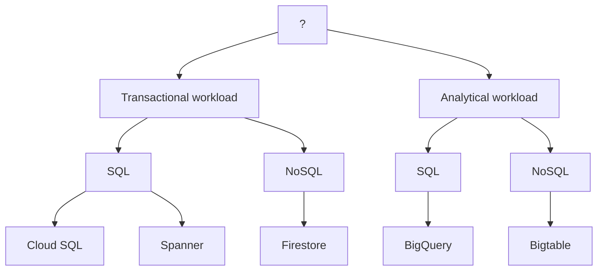

Ya conoce las diferentes opciones de almacenamiento que ofrece Google Cloud, pero ¿en qué escenarios debería usar cada una? En definitiva, se trata de una combinación del tipo de datos que se necesitan almacenar y las necesidades del negocio.

- Si los datos no están estructurados, Cloud Storage es la opción más adecuada. Debe elegir una clase de almacenamiento:

    - Estándar

    - Nearline

    - Coldline

    - Archivo

o si prefiere que la función de clase automática (Autoclass) lo decida por usted.

- Si los datos son estructurados o semiestructurados, la elección de un producto de almacenamiento dependerá de si las cargas de trabajo son transaccionales o analíticas. Las cargas de trabajo transaccionales provienen del procesamiento de transacciones en línea (OLTP), que se utilizan cuando se requieren inserciones y actualizaciones rápidas de datos para crear registros basados en filas. Un ejemplo de esto son los registros de transacciones en el punto de venta.

### Cargas de trabajo transaccionales (OLTP)
- **Qué son**: Son los procesos que manejan transacciones individuales, generalmente cortas, que necesitan insertarse, actualizarse o eliminarse rápidamente.

- **Objetivo principal**: Garantizar que los datos se registren de manera correcta y rápida.

- **Ejemplos**:

    - Cada vez que pagas en una tienda, el sistema registra la compra en tiempo real.

    - Un cajero automático que actualiza tu saldo al retirar dinero.

- **Características**:

    - Operaciones rápidas y pequeñas (lectura/escritura).

    - Normalmente se usan bases de datos relacionales (tablas con filas y columnas).

    - Los datos se modifican constantemente.

    - El enfoque está en la consistencia y velocidad de cada transacción.

Luego están las cargas de trabajo analíticas, que provienen del procesamiento analítico en línea (OLAP), que se utilizan cuando se necesitan leer conjuntos de datos completos. A menudo requieren consultas complejas, por ejemplo, agregaciones. Un ejemplo sería analizar el historial de ventas para ver tendencias y vistas agregadas.

### Cargas de trabajo analíticas (OLAP)
- **Qué son**: Son procesos diseñados para analizar grandes volúmenes de datos (históricos o actuales) en busca de patrones, tendencias o reportes.

- **Objetivo principal**: Leer y procesar grandes conjuntos de datos para obtener información.

- **Ejemplos**:

    - Analizar el historial de ventas de los últimos 5 años para conocer las temporadas más rentables.

    - Generar dashboards o informes con métricas clave.

- **Características**:

    - Lecturas de grandes cantidades de datos.

    - Consultas complejas, como agregaciones, cálculos y resúmenes.

    - No se enfocan tanto en insertar o actualizar datos en tiempo real.

    - Se prioriza la velocidad en las consultas y análisis, no en las escrituras.

#### Comparación simple
- **Transaccional (OLTP)**: Muchas operaciones pequeñas y rápidas, normalmente en tiempo real. Ideal para sistemas operativos del día a día (ventas, reservas, banca).

- **Analítica (OLAP)**: Pocas operaciones, pero muy pesadas, para analizar grandes volúmenes de datos. Ideal para reportes e inteligencia de negocio.

#### Ejemplo práctico:
Un supermercado:

- **OLTP**: Cada vez que alguien pasa un producto por la caja, el sistema registra esa venta (inserción rápida).

- **OLAP**: A fin de mes, la empresa consulta el historial de todas las ventas para ver qué productos se vendieron más.

[Cargas de trabajo (Esquema)](/assets/Cargas_de_trabajo.png)

Después de determinar si las cargas de trabajo son transaccionales o analíticas, debe determinar si se accederá a los datos mediante SQL. Por lo tanto, si sus datos son transaccionales y necesita acceder a ellos mediante SQL, Cloud SQL y Spanner son dos opciones:

- Cloud SQL funciona mejor para la escalabilidad local y regional.

- Spanner es la mejor opción para escalar una base de datos globalmente.

Si se accederá a los datos transaccionales sin SQL, Firestore podría ser la mejor opción. Firestore es una base de datos NoSQL transaccional orientada a documentos.

Si tiene cargas de trabajo analíticas que requieren comandos SQL, BigQuery podría ser la mejor opción. BigQuery, la solución de almacenamiento de datos de Google, le permite analizar conjuntos de datos a escala de petabytes. Como alternativa, Bigtable ofrece una solución NoSQL escalable para cargas de trabajo analíticas. Es ideal para aplicaciones en tiempo real de alto rendimiento.

